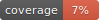

# Vertex AI chat


[](https://github.com/leliw/vertex-ai-chat/actions/workflows/main.yml)



Chat application for general purposes usig `VertexAI` and `gemini-1.*` models.

## Changelog

For a detailed history of changes, please refer to the [CHANGELOG.md](CHANGELOG.md) file.

## Preparing environment

### Backend

```bash
cd backend
uv init . --python 3.12 --bare
uv venv --prompt vertex-ai-chat
source .venv/bin/activate
uv sync --dev
```

Create `backend/.env` file.

```.env
JWT_SECRET_KEY=
GOOGLE_APPLICATION_CREDENTIALS=
```

```bash
gcloud alpha firestore indexes composite create --project=vertex-ai-chat-dev --collection-group=KnowledgeBase --query-scope=COLLECTION --field-config=vector-config='{"dimension":"256","flat": "{}"}',field-path=embedding
```

## Testing

### Testing backend (python)

```bash
cd backend
pytest --cov=. tests/ --cov-report html
```

Report is gnerated as html here: `backend/htmlcov/index.html`.

## Running

The application is available at: [https://chat.hanse-intelli-tech.pl/](https://chat.hanse-intelli-tech.pl/)

### Running in develpment evironment

```bash
source ./run_dev.sh
```

To quit: press `Q` + `Enter`.
